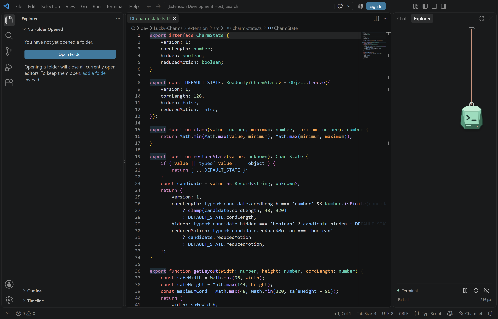

# Charmlet

**Charmlet: Coding Charms** is a small, interactive hanging charm for VS Code.
Phase 0 proves the interaction in a **docked view**, not a floating overlay over code or the desktop.

**Status, 2026-09-17:** one original terminal-keycap prototype, validated locally on Windows / VS Code
1.138.0. No Marketplace or Open VSX release yet. No telemetry, account, payment or runtime AI required.

[Phase 0 merged in PR #4](https://github.com/gautham-nvidia/charmlet/pull/4) after
[hosted Windows CI passed](https://github.com/gautham-nvidia/charmlet/actions/runs/35273596086).



## Run the demo

Use Node.js 24, npm, and desktop VS Code. The source lives in [extension/](extension/).

**On the Windows PC (PowerShell), from this repository's root:**

```powershell
npm.cmd --prefix extension ci
npm.cmd --prefix extension run compile
code.cmd --new-window --extensionDevelopmentPath "$PWD\extension" --user-data-dir "$env:TEMP\charmlet-phase0-demo" --extensions-dir "$env:TEMP\charmlet-phase0-demo-extensions" .
```

This opens an isolated **Extension Development Host**; your normal extensions and pane layout remain
unchanged. After rebuilding, reload that demo window to load the updated code.

1. In the demo window, press **Ctrl+Shift+P**, then run **Charmlet: Show Charm**.
2. Run **View: Move View**, choose **Charmlet**, then **New Secondary Side Bar Entry** for a right dock.
3. Click to nudge; pull down to park, sideways to swing, and up to retract. The eye restores it.

Motion and reset controls live below the charm. Tab to the charm for Enter/Space, arrow-key and Escape
controls. See [extension/README.md](extension/README.md) for the full controls and limitations.

## Verify and package

**On the Windows PC (PowerShell), from the repository root:**

```powershell
npm.cmd --prefix extension test
npm.cmd --prefix extension run package:vsix
```

`test` builds and lints both bundles, runs five state/physics tests and one real-editor interaction
regression. It launches a disposable VS Code profile that ignores physical mouse input during automation.
It uses the standard Windows VS Code install; `VSCODE_EXECUTABLE` can select another installed executable.

The VSIX is written under `extension/` and ignored by Git. Install it using **Extensions: Install from
VSIX...** for manual testing. Packaging uses `--skip-license` because the project's own license decision
is still open, not because third-party licenses are waived. Required notices ship in the package.

[CI](.github/workflows/ci.yml) builds, tests against a pinned Windows VS Code host, and packages each PR
and `main` update. Test screenshots and the VSIX are retained as workflow artifacts tied to the commit.
CI does not publish to extension registries.

## Traceability and workflow

| Record | Purpose |
|---|---|
| [PROJECT_LOG.md](PROJECT_LOG.md) | Dated decisions, commits, verification evidence and milestone status |
| [Roadmap issue #1](https://github.com/gautham-nvidia/charmlet/issues/1) | Project-wide milestones and release gates |
| [Phase 0 issue #3](https://github.com/gautham-nvidia/charmlet/issues/3) | Prototype delivery and acceptance checks |
| [Next: Phase 1 issue #2](https://github.com/gautham-nvidia/charmlet/issues/2) | Free-core polish, accessibility and compatibility checks |
| [extension/CHANGELOG.md](extension/CHANGELOG.md) | User-visible changes by version and date |
| [PLAN.md](PLAN.md) | Design research, constraints and clearly marked historical proposals |

For each change: use a linked issue and `feat/`, `fix/` or `docs/` branch; write descriptive commits;
update the log and relevant README/changelog; run the checks; open a PR using the checklist; merge with
a **merge commit** to preserve the branch's commits. Do not force-push `main` or rewrite published history.
Git records the authoritative author, date, full message and diff. Put the why and test evidence in the
commit body and PR, not just "update files".

**On the Windows PC (PowerShell), from the repository root:**

```powershell
git log --all --graph --date=iso-strict --format="%h %ad %s"
git log --follow --date=short --format="%h %ad %s" -- PROJECT_LOG.md
```

Next: refine the free core before adding three finished free charms. Compatibility testing and dual
registry publishing follow; status-bar motivation and paid cosmetics are later, separate features.
Publishing requires its own approval and identity/license decisions. The manifest's 1.90 API floor
compiles; the minimum runtime, macOS/Linux, Cursor/Devin Desktop and remote/browser hosts are unverified.

## Ownership and licenses

Personal repository under `gautham-nvidia`, **not** the NVIDIA organization or an endorsed product.
No NVIDIA-branded assets are included. The core and bundled starter items are intended to remain free.
Public visibility does not assign an open-source license: Charmlet's source/art license is pending.
[Third-party notices](extension/THIRD_PARTY_NOTICES.md) cover Matter.js and Lucide/Feather assets.
