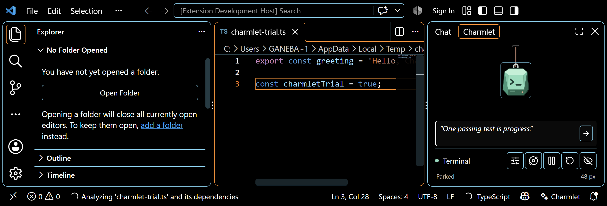

# Charmlet

**Charmlet: Coding Charms** is a small, interactive hanging charm in a dockable VS Code view.

**Status, 2026-10-08:** Phase 4B development candidate **0.4.1** adds a free eleven-watering garden and
optional gentle water/move reminders to Focus, Learn, ten bundled charms, 80 encouragement messages,
six free website extras and the offline importer. Expanded artwork, paid Photo Studio and desktop beta
remain planned work in the [Focus, Learn and Grow plan](docs/phase-4-plan.md), not features in this candidate.

The 0.3.2 baseline passed its six-job hosted matrix. Phase 4A run 37860624048 passed Windows/Linux but macOS exposed test assertions that compared temporarily fitted cord length while controls were open; no saved-preference regression was established. The 0.4.1 Garden/Care candidate passes 58 units and two focused local VS Code 1.140.0 UI scenarios, but still requires hosted verification. See the frozen [preference restoration proof](docs/phase-3-preferences.json) and [Phase 3 readiness](docs/phase-3-readiness.md).

[Gallery and compact-feedback tracking #13](https://github.com/gautham-nvidia/charmlet/issues/13), the
[dated validation record](docs/phase-3-gallery-validation.md), and the frozen [desktop platform summary](docs/phase-3-platforms.json)
show the checks and remaining review items.



Choose among ten bundled charms in the grouped picker. The default **Hanging** layout keeps the peg near
the top and reserves pull room; the Orbit toolbar toggle reserves space for full fixed-peg loops. A
straight upward pull retracts the charm and the arrow restores it. The Cord setting is the saved resting
preference, while the visible cord may temporarily shorten to fit the current panel.

The card below the charm now offers 60 sourced facts, 30 sourced trivia questions and the existing 80
optional encouragement messages. Use **Next coding message**, choose the saved feed mode, reveal trivia
answers or open a trusted source. Automatic five-minute rotation pauses while the view is unavailable,
settings/tools are open, a card is active or a drag is in progress.

Open **Companion tools** or run **Charmlet: Focus Session** for a deadline-based focus/break timer with
25/5, 50/10 or custom durations, pause/resume/stop and an optional one-line intention. It restores a real
running or paused session after reload without auto-starting another session or counting completed work.

The free **Garden** hides one original species until its eleventh valid watering day, keeps progress through
missed days, and adds the bloom to **Grown by you** before it can be explicitly hung. Optional water and
stand/move reminders are off by default and use one quiet in-drawer cue with Done, Snooze or Skip.

## Run the demo

Use Node.js 24, npm, and desktop VS Code. The source lives in [extension/](extension/).

**On the Windows PC (PowerShell), from this repository's root:**

```powershell
npm.cmd --prefix extension ci
npm.cmd --prefix extension run compile
code.cmd --new-window --extensionDevelopmentPath "$PWD\extension" --user-data-dir "$env:TEMP\charmlet-phase3-demo" --extensions-dir "$env:TEMP\charmlet-phase3-demo-extensions" .
```

This opens an isolated **Extension Development Host**; your normal extensions and pane layout remain
unchanged. After rebuilding, reload that demo window to load the updated code.

1. In the demo window, press **Ctrl+Shift+P**, then run **Charmlet: Show Charm**.
2. Run **View: Move View**, choose **Charmlet**, then **New Secondary Side Bar Entry** for a right dock.
3. Click to nudge or pull and release to return to rest. Switch on **Orbit layout** before dragging a full loop. A straight upward pull retracts the charm; the restore arrow brings it back.
4. Open **Charm settings** to choose a charm, size and resting cord length. Escape closes settings.

| Group | Bundled charms |
|---|---|
| Silicon & Code | Terminal, Chip, Wafer, Circuit, Transistor, Memory Stack |
| Good Luck | Evil Eye, Drishti Doll, Hamsa, Lemon & Chilies |

Extra free charms use validated `.charmlet.json` files. Run **Charmlet: Import Charm Pack** to add one and
**Charmlet: Remove Charm Pack** to remove an imported pack. Imported PNG artwork is stored separately
from extension files, survives updates and works offline.

Motion and reset controls live below the charm. Tab to the charm for Enter/Space, arrow-key and Escape
controls. See [extension/README.md](extension/README.md) for the full controls and limitations.

## Verify and package

**On the Windows PC (PowerShell), from the repository root:**

```powershell
npm.cmd --prefix extension test
npm.cmd --prefix extension run package:vsix
```

`test` builds and lints both bundles, runs the state/physics, pack, focus/learning/garden/care, persistence and file-store unit suites and three real-editor interaction
regressions. It launches a disposable VS Code profile and edits only a temporary file. The test window
ignores physical mouse input during automation. Set `VSCODE_TEST_VERSION` to select an exact cached/
downloaded host; otherwise it uses the installed VS Code, with `VSCODE_EXECUTABLE` as an override.
See the [validation record](docs/phase-3-gallery-validation.md) for compact, gallery, import and message checks.

The VSIX is written under `extension/` and ignored by Git. Install it using **Extensions: Install from
VSIX...** for manual testing. Packaging uses `--skip-license` because the project's own license decision
is still open, not because third-party licenses are waived. Required notices ship in the package.

[CI](.github/workflows/ci.yml) runs six jobs across Windows, Ubuntu 24.04 and macOS 15 with VS Code
**1.90.0 and 1.140.0**. All six passed the 0.3.2 baseline's 34-unit/UI/package/gallery path in hosted run [37697185841](https://github.com/gautham-nvidia/charmlet/actions/runs/37697185841).
Linux uses Xvfb; screenshots, resource snapshots, the VSIX and static gallery are retained as workflow
artifacts. This verifies the listed runners, not every OS/hardware/editor host. CI does not deploy or publish.

## Companion gallery

The source under [website/](website/) builds a static local gallery with six free extra charms and real
pack/VSIX downloads. A `.vsix` installs the extension; a `.charmlet.json` adds artwork only after Charmlet
is installed. Store links are driven by validated `website/distribution.json` values and remain null until
the owner verifies a live identity-matching listing. URL validation is not proof of publication. This is
a development preview, not a public URL or Marketplace/Open VSX listing.

**On the Windows PC (PowerShell), from the repository root, after locked dependencies are installed:**

```powershell
npm.cmd --prefix extension run compile
npm.cmd --prefix extension run test:unit
npm.cmd --prefix extension run package:vsix
node website/build.mjs
node website/server.mjs
```

Leave the server terminal running and visit `http://127.0.0.1:4173`. In a separate PowerShell terminal,
run `node website/check.mjs` to verify filters, images, downloads, overflow, keyboard focus and browser errors.

## Traceability and workflow

| Record | Purpose |
|---|---|
| [PROJECT_LOG.md](PROJECT_LOG.md) | Dated decisions, commits, verification evidence and milestone status |
| [Roadmap issue #1](https://github.com/gautham-nvidia/charmlet/issues/1) | Project-wide milestones and release gates |
| [Phase 0 issue #3](https://github.com/gautham-nvidia/charmlet/issues/3) | Prototype delivery and acceptance checks |
| [Phase 1 issue #2](https://github.com/gautham-nvidia/charmlet/issues/2) | Free-core polish, accessibility and compatibility checks |
| [Phase 1 validation](docs/phase-1-validation.md) | Windows compatibility, interaction evidence and resource captures |
| [Phase 2 issue #9](https://github.com/gautham-nvidia/charmlet/issues/9) | Free collection, saved selection and trial package |
| [Phase 2 validation](docs/phase-2-validation.md) | Collection screenshots and Windows checks |
| [Phase 3 issue #11](https://github.com/gautham-nvidia/charmlet/issues/11) | Compatibility and release readiness |
| [Phase 3 readiness](docs/phase-3-readiness.md) | Host evidence, automation limits and release gates |
| [Phase 4 issue #17](https://github.com/gautham-nvidia/charmlet/issues/17) | Focus, learning, reminders, garden and original collections implementation |
| [Phase 4 plan](docs/phase-4-plan.md) | Current product scope, architecture, slices and acceptance gates |
| [Phase 4 collection brief](docs/phase-4-original-collections.md) | Concrete 60-design free-catalogue planning target and garden palette |
| [Phase 5 issue #18](https://github.com/gautham-nvidia/charmlet/issues/18) | Publisher/license decisions and extension-store launch gates |
| [Desktop platform summary](docs/phase-3-platforms.json) | Frozen six-job Windows/Linux/macOS identities and accepted motion/lifecycle values |
| [Preference restoration proof](docs/phase-3-preferences.json) | Frozen canonical-file readback/ack/restart evidence from both macOS versions |
| [Full-circle validation](docs/full-circle-validation.md) | Orbit screenshots and rendered-motion evidence |
| [Gallery and compact feedback #13](https://github.com/gautham-nvidia/charmlet/issues/13) | Ten defaults, messages, packs and companion gallery |
| [Gallery validation](docs/phase-3-gallery-validation.md) | Compact, message, import, orbit and website evidence |
| [Website guide](website/README.md) | Build, preview and reusable browser check |
| [Charm pack format](docs/charm-packs.md) | Validated data-only import format and limits |
| [Paid artwork proposal](docs/paid-artwork-plan.md) | Non-live collection, rights, fulfillment and owner-decision plan |
| [Competitive review and desktop direction](docs/competitive-review.md) | Sourced product comparison, proposed free focus timer and standalone-host tradeoffs |
| [Artwork provenance](extension/ARTWORK.md) | Asset origins, shared geometry and license status |
| [extension/CHANGELOG.md](extension/CHANGELOG.md) | User-visible changes by version and date |
| [PLAN.md](PLAN.md) | Design research, constraints and clearly marked historical proposals |

For each change: use a linked issue and `feat/`, `fix/` or `docs/` branch; write descriptive commits;
update the log and relevant README/changelog; run the checks; open a PR using the checklist; merge with
a **merge commit** to preserve the branch's commits. Do not force-push `main` or rewrite published history.
Use a dedicated branch for each phase. Finish its checks and merge that phase into `main` before
starting the next phase. Retain the merged branch for traceability.
Git records the authoritative author, date, full message and diff. Put the why and test evidence in the
commit body and PR, not just "update files".

**On the Windows PC (PowerShell), from the repository root:**

```powershell
git log --all --graph --date=iso-strict --format="%h %ad %s"
git log --follow --date=short --format="%h %ad %s" -- PROJECT_LOG.md
```

The owner has authorized the [Phase 4 companion work](docs/phase-4-plan.md) and parallel website/desktop
development. Phase 5 is extension-store launch, Phase 6 the broader product launch, and Phase 7+ later
integrations. Publisher ownership, source/art licensing, actual launch-target editor checks and public
hosting/publication remain explicit gates in [Phase 5 #18](https://github.com/gautham-nvidia/charmlet/issues/18).
Each phase keeps its own branch and merges before the next.

## Ownership and licenses

Personal repository under `gautham-nvidia`, **not** the NVIDIA organization or an endorsed product.
No NVIDIA-branded assets are included. The core and bundled starter items are intended to remain free.
Public visibility does not assign an open-source license: Charmlet's source/art license is pending.
[Third-party notices](extension/THIRD_PARTY_NOTICES.md) cover Matter.js and Lucide/Feather assets.
