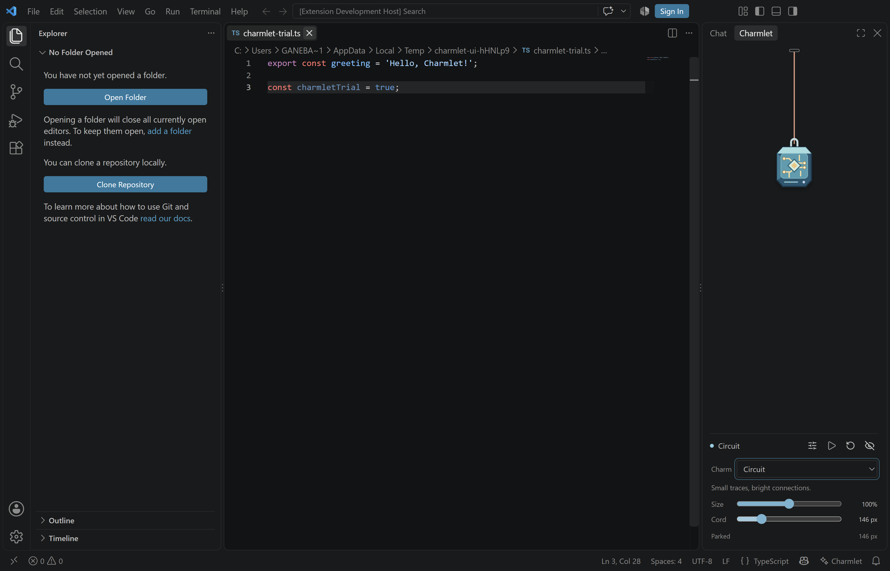

# Charmlet

**Charmlet: Coding Charms** is a small, interactive hanging charm in a dockable VS Code view.

**Status, 2026-10-05:** Phase 2 development build **0.1.0**, with **four free original charms**, a saved
Charm picker and real-editor checks passing on Windows / VS Code **1.90.0 and 1.138.0**. No telemetry,
account, payment or runtime AI is required.

[Phase 2 tracking](https://github.com/gautham-nvidia/charmlet/issues/9) and the
[dated validation record](docs/phase-2-validation.md) show the checks and remaining review items.



Choose **Terminal**, **Chip**, **Wafer** or **Circuit** in Charm settings. Your selection and resting
preferences are saved locally. Pulling is temporary: releasing returns the charm to its selected
resting length and position.

## Run the demo

Use Node.js 24, npm, and desktop VS Code. The source lives in [extension/](extension/).

**On the Windows PC (PowerShell), from this repository's root:**

```powershell
npm.cmd --prefix extension ci
npm.cmd --prefix extension run compile
code.cmd --new-window --extensionDevelopmentPath "$PWD\extension" --user-data-dir "$env:TEMP\charmlet-phase2-demo" --extensions-dir "$env:TEMP\charmlet-phase2-demo-extensions" .
```

This opens an isolated **Extension Development Host**; your normal extensions and pane layout remain
unchanged. After rebuilding, reload that demo window to load the updated code.

1. In the demo window, press **Ctrl+Shift+P**, then run **Charmlet: Show Charm**.
2. Run **View: Move View**, choose **Charmlet**, then **New Secondary Side Bar Entry** for a right dock.
3. Click to nudge; pull downward to stretch, then release to return to the resting position. Pull upward to retract; the eye restores it.
4. Open **Charm settings** to choose a charm, size and resting cord length. Escape closes settings.

Motion and reset controls live below the charm. Tab to the charm for Enter/Space, arrow-key and Escape
controls. See [extension/README.md](extension/README.md) for the full controls and limitations.

## Verify and package

**On the Windows PC (PowerShell), from the repository root:**

```powershell
npm.cmd --prefix extension test
npm.cmd --prefix extension run package:vsix
```

`test` builds and lints both bundles, runs seventeen state/physics tests and one real-editor interaction
regression. It launches a disposable VS Code profile and edits only a temporary file. The test window
ignores physical mouse input during automation. Set `VSCODE_TEST_VERSION` to select an exact cached/
downloaded host; otherwise it uses the installed VS Code, with `VSCODE_EXECUTABLE` as an override.
See the [validation record](docs/phase-2-validation.md) for collection checks and screenshots.

The VSIX is written under `extension/` and ignored by Git. Install it using **Extensions: Install from
VSIX...** for manual testing. Packaging uses `--skip-license` because the project's own license decision
is still open, not because third-party licenses are waived. Required notices ship in the package.

[CI](.github/workflows/ci.yml) builds, tests and packages on Windows with VS Code **1.90.0 and 1.138.0**
for each PR and `main` update. Screenshots, resource snapshots and the VSIX are retained as workflow
artifacts tied to the commit. CI does not publish to extension registries.

## Traceability and workflow

| Record | Purpose |
|---|---|
| [PROJECT_LOG.md](PROJECT_LOG.md) | Dated decisions, commits, verification evidence and milestone status |
| [Roadmap issue #1](https://github.com/gautham-nvidia/charmlet/issues/1) | Project-wide milestones and release gates |
| [Phase 0 issue #3](https://github.com/gautham-nvidia/charmlet/issues/3) | Prototype delivery and acceptance checks |
| [Phase 1 issue #2](https://github.com/gautham-nvidia/charmlet/issues/2) | Free-core polish, accessibility and compatibility checks |
| [Phase 1 validation](docs/phase-1-validation.md) | Windows compatibility, interaction evidence and resource captures |
| [Phase 2 issue #9](https://github.com/gautham-nvidia/charmlet/issues/9) | Free collection, saved selection and trial package |
| [Phase 2 validation](docs/phase-2-validation.md) | Collection screenshots and Windows checks |
| [Artwork provenance](extension/ARTWORK.md) | Asset origins, shared geometry and license status |
| [extension/CHANGELOG.md](extension/CHANGELOG.md) | User-visible changes by version and date |
| [PLAN.md](PLAN.md) | Design research, constraints and clearly marked historical proposals |

For each change: use a linked issue and `feat/`, `fix/` or `docs/` branch; write descriptive commits;
update the log and relevant README/changelog; run the checks; open a PR using the checklist; merge with
a **merge commit** to preserve the branch's commits. Do not force-push `main` or rewrite published history.
Use a dedicated branch for each phase. Finish its checks and merge that phase into `main` before
starting the next phase. Retain the merged branch for traceability.
Git records the authoritative author, date, full message and diff. Put the why and test evidence in the
commit body and PR, not just "update files".

**On the Windows PC (PowerShell), from the repository root:**

```powershell
git log --all --graph --date=iso-strict --format="%h %ad %s"
git log --follow --date=short --format="%h %ad %s" -- PROJECT_LOG.md
```

Next: try the free collection and finish Phase 2 integration before starting Phase 3 compatibility and
release work. The optional full-circle idea is tracked separately in [#8](https://github.com/gautham-nvidia/charmlet/issues/8).
Registry publication still requires its own approval and identity/license decisions. Other operating
systems, Cursor/Devin Desktop and remote/browser hosts remain unverified.

## Ownership and licenses

Personal repository under `gautham-nvidia`, **not** the NVIDIA organization or an endorsed product.
No NVIDIA-branded assets are included. The core and bundled starter items are intended to remain free.
Public visibility does not assign an open-source license: Charmlet's source/art license is pending.
[Third-party notices](extension/THIRD_PARTY_NOTICES.md) cover Matter.js and Lucide/Feather assets.
