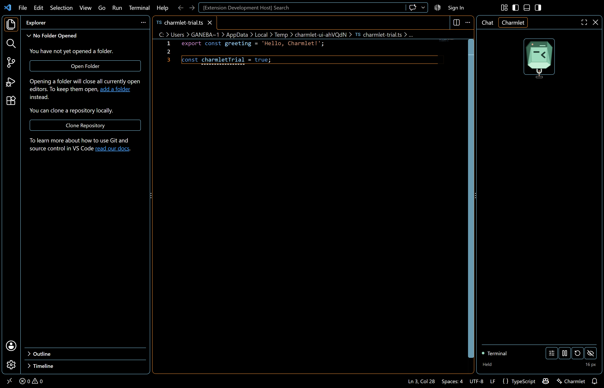
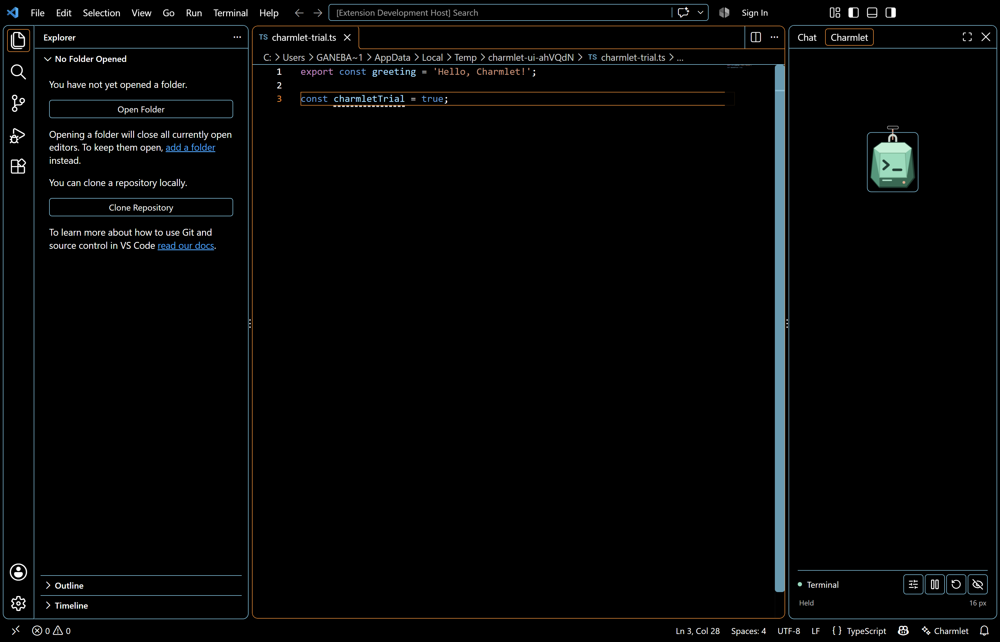
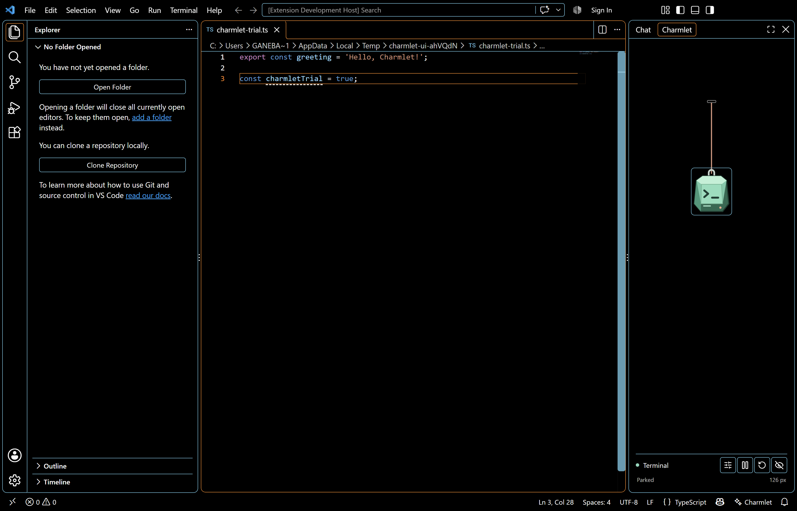

# Full-circle orbit validation - 2026-10-06

Development version **0.2.0** lets the charm and cord complete a loop around a stationary peg, as requested in [#8](https://github.com/gautham-nvidia/charmlet/issues/8). This is part of the Phase 3 branch and PR #12.

## Interaction

Grab the charm and move it around the peg in either direction. Moving closer to the peg makes a compact loop easier in a narrow panel. The temporary cord length follows the direction and distance of the drag and is limited by the visible space. Release returns to the resting length chosen in settings.

The peg has clearance above it and remains fixed during a gesture. Its layout can adjust when the view or size setting changes. Small views scale the logical play area to fit. A lateral orbit released above the peg returns safely; an ordinary straight upward pull still hides the charm.

## Verified on the Windows PC

- Type checking, lint and bundles passed.
- **19 unit tests passed**, including both orbit directions at sizes 60, 100 and 140, immediate/reduced-motion input, holding above the peg, upper release and long-rest-length recovery from each quadrant.
- The complete real-editor suite passed on **VS Code 1.90.0 and 1.140.0**, including all prior selection, pull/return, cancellation, focus, reduced-motion and high-contrast checks.
- Each UI orbit test drove one and a half turns, held above the peg, then released and checked visible recovery to the 126 px resting setting without refresh or accidental hiding.

## Rendered-motion evidence

The observations read the rendered charm's angle, position, bounds and peg coordinates. The lead independently unwrapped consecutive recorded angles and checked the bounds/peg/quadrant invariants.

| Host | Captured samples per direction | Rendered travel between first/last samples | Quadrants | Bounds and peg |
|---|---|---|---|---|
| VS Code 1.90.0 | 96 | More than 360 degrees in both directions | All four | Every captured position in view; peg unchanged |
| VS Code 1.140.0 | 96 | More than 360 degrees in both directions | All four | Every captured position in view; peg unchanged |

Raw captures: [1.90.0](phase-3/orbit-1.90.0.json), [1.140.0](phase-3/orbit-1.140.0.json). The first sample occurs after motion starts, so the independent first-to-last calculation intentionally excludes the initial unrecorded segment. The rendered samples still establish more than a complete turn. Bounds checks allow one CSS pixel for rounding.

These checked captures are preserved rather than regenerated. No new CPU/frame-rate claim is made. Other editor/platform and publishing gates remain in [Phase 3 readiness](phase-3-readiness.md); fork login blockers are unchanged.
