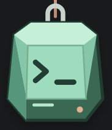
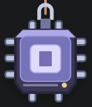
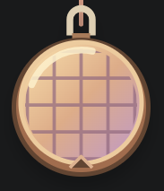
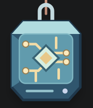

# Phase 2 validation - 2026-10-05

Development version **0.1.0** adds three original Silicon Pack designs to Terminal, with a saved Charm picker. Tracking: [P2 #9](https://github.com/gautham-nvidia/charmlet/issues/9).

| Terminal | Chip | Wafer | Circuit |
|---|---|---|---|
|  |  |  |  |

## Verified on the Windows PC

| Check | Result |
|---|---|
| Type checking, lint and bundles | Passed |
| State/physics unit tests | 17 passed |
| VS Code 1.90.0 | Complete real-editor test passed |
| VS Code 1.138.0 | Complete real-editor test passed |
| Collection loading | All four local SVG resources loaded at 72x84 natural size; names and accessible labels matched the selection |
| Keyboard selection | Native Home/End selection exercised |
| Persistence | Selected charm survived reload with cord and motion preferences retained |
| Reset | Selected charm retained while position/size/cord returned to defaults; motion preference retained |
| Hidden state | Changing selection kept a hidden charm hidden |
| Existing behavior | Phase 1 gestures, return-to-rest, cancellation, sizing, focus, reduced motion and high-contrast checks still passed |

The screenshots above are copies of the checked run's captures. The Phase 1 numerical resource records remain their original dated evidence; no new CPU or memory comparison is claimed here.

The phase PR records hosted CI and integration. Artwork provenance is in [ARTWORK.md](../extension/ARTWORK.md). The [optional trial checklist](phase-2-trial.md) is prepared; no coworker distribution or human trial results are claimed.

Other OS/editors and remote/browser hosts remain unverified. This is a local development package, not a Marketplace/Open VSX publication.
