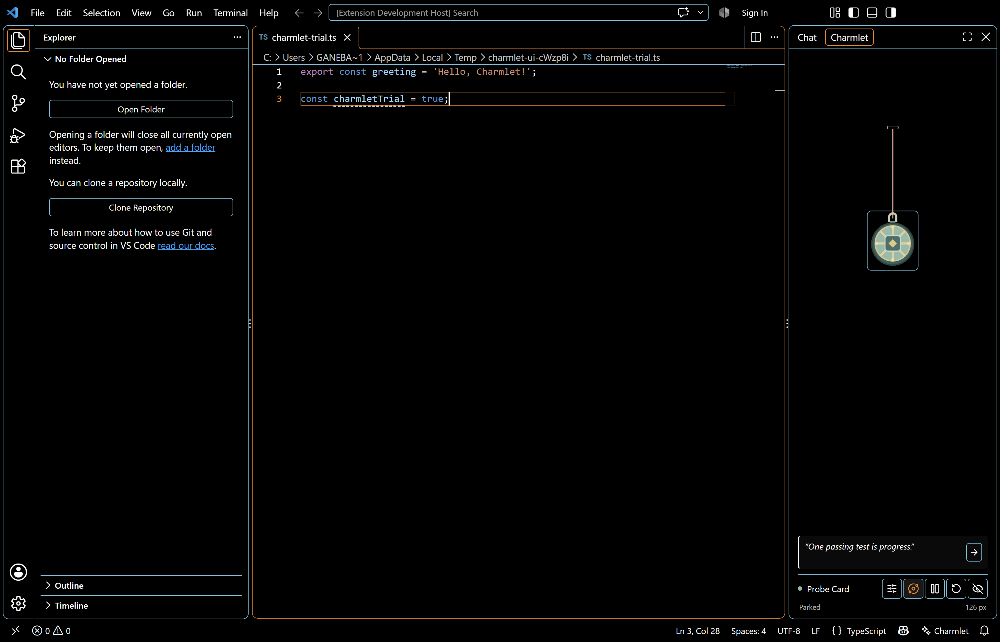
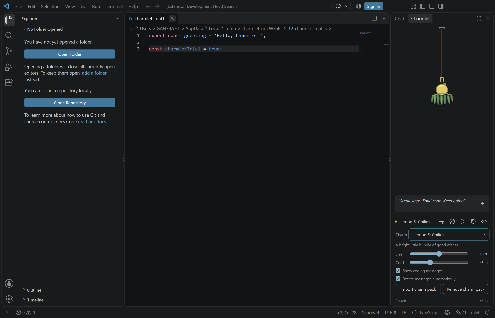
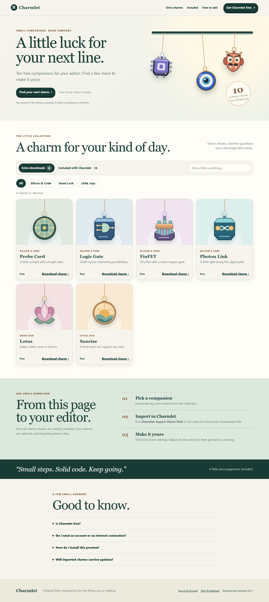
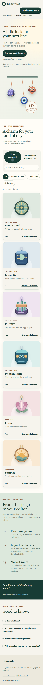

# Phase 3 gallery validation - 2026-10-06

Development version **0.3.1** delivers issue [#13](https://github.com/gautham-nvidia/charmlet/issues/13) within Phase 3 readiness [#11](https://github.com/gautham-nvidia/charmlet/issues/11). It bundles ten free original designs in **Silicon & Code** and **Good Luck**, adds six free website extras, supports PNG charm-pack import/removal, provides compact Hanging and optional Orbit layouts, and shows 80 coding messages directly below the stage and above the controls.

## Interaction fixes

- Resting layout reserves downward pull space, including compact logical views.
- The Cord setting preserves the requested resting preference while the visible length fits the available space. The UI test verifies that preference across clamping and reload, then checks the full length when enough room is restored.
- A deliberate upward pull finishes retraction before the pointer leaves the Hanging view.
- The restore arrow remains a **30×28 view-pixel** target even when the play area is scaled.
- Re-entering without pressed buttons recovers a missed outside release.
- Orbit layout retains the fixed-peg full-circle interaction and bounded return.

## Coding messages

The extension contains **80 original, unattributed messages**. The card sits immediately below the stage, not below settings. Automatic rotation uses a five-minute timeout only while the view and document are visible, messages are enabled, settings are closed, and no drag is active. Manual **Next** advances immediately and restarts the countdown. The automatic-rotation and visibility preferences persist. Messages do not use popups, a network service, runtime AI, or polling.

## Verified on the Windows PC

| Check | Result |
|---|---|
| Compile, type checking and lint | Passed |
| Unit tests | **27 passed**: 20 state/physics/catalogue, 5 pack parser/store, 2 message timer |
| VS Code 1.140.0 | Complete real-editor suite passed |
| VS Code 1.90.0 | Complete real-editor suite passed |
| Bundled collection | Ten images loaded; Silicon & Code and Good Luck groups verified |
| Compact behavior | Pull room, upward retract, 30×28 restore target and missed-release recovery passed |
| Message state | Placement, manual Next, persisted text, saved rotation on/off and pause while settings are open passed |
| Layout and orbit | Saved Hanging/Orbit mode and fixed-peg rendered-body loop checks passed |
| Imported pack | Probe Card imported through the supported command, loaded as a 288 px PNG, moved, survived reload and was removed with Terminal fallback |

The lead checked the frozen orbit evidence: each host contains 96 rendered samples per direction, more than 360 degrees of recorded travel in both directions, all four quadrants, fixed peg coordinates, and every captured bound inside the view.

| Host | Direction -1 | Direction +1 |
|---|---:|---:|
| VS Code 1.90.0 | 534.3° | 534.4° |
| VS Code 1.140.0 | 534.4° | 533.9° |

Raw captures: [VS Code 1.90.0](phase-3-gallery/orbit-1.90.0.json) and [VS Code 1.140.0](phase-3-gallery/orbit-1.140.0.json). Settled and hidden animation-frame deltas were zero on both hosts. No new CPU, memory, or frame-rate comparison is made; the raw lifecycle invariants remain checked.

## Companion gallery

The static website was checked in installed Microsoft Edge at 1440 px desktop and 375×812 mobile sizes.

| Check | Result |
|---|---|
| Catalogue | Six extras by default; ten included charms |
| Artwork | Hero and gallery images decoded |
| Interaction | Kind/group filters, search, reset and retained keyboard focus passed |
| Layout | No horizontal overflow at desktop or mobile sizes |
| Downloads | A real Probe Card pack downloaded and parsed; the real development VSIX download matched its source bytes |
| Browser health | No console or page errors |

Frozen website result: [website-results.json](phase-3-gallery/website-results.json).

Hosted CI and integration evidence will be recorded by the phase PR. The localhost preview is not public hosting. Other Phase 3 operating-system, authenticated-fork, remote/browser, publisher, license, listing and registry-publication gates remain open. No checkout or registry publication is included.
