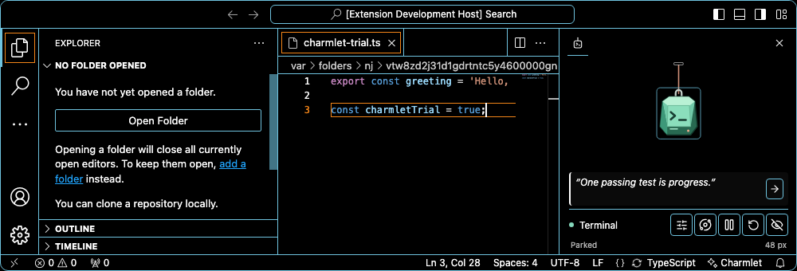
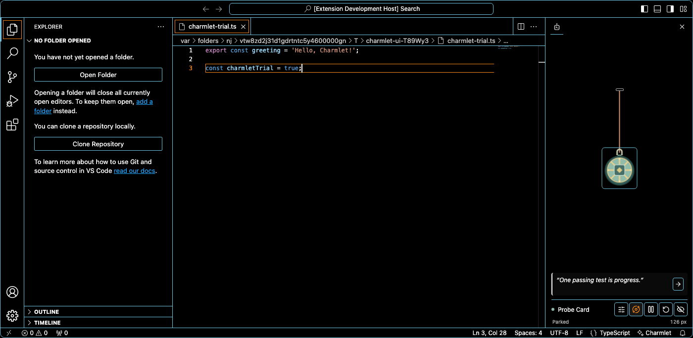
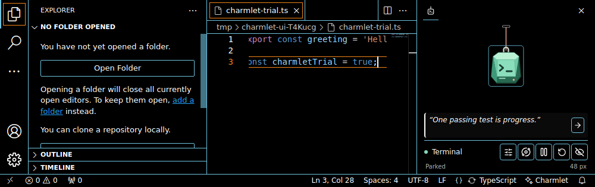

# Phase 3 readiness - 2026-10-05

Phase 3 has started on `feat/phase-3-readiness` from the merged Phase 2 build, **0.1.0**. Tracking: [P3 #11](https://github.com/gautham-nvidia/charmlet/issues/11); [full-circle interaction #8](https://github.com/gautham-nvidia/charmlet/issues/8). This checkpoint changes test infrastructure and documents release gaps; it does not publish a release or implement an unspecified rotation behavior.

## Compatibility evidence

| Host | Evidence | Status |
|---|---|---|
| Windows / VS Code 1.90.0 | P2 local and hosted complete interaction suite | Verified baseline; retained engine-floor CI target |
| Windows / VS Code 1.138.0 | P2 local and hosted complete interaction suite | Verified historical baseline |
| Windows / VS Code 1.140.0 | Complete local interaction suite passed; runtime reports `Code`, 1.140.0, Electron 43.7.3, win32/x64 | Verified local baseline; selected as the recent CI target |
| Windows / Cursor 3.20.21 | Installed metadata reports VS Code 1.128.0; disposable-profile proof and scratch-file readiness passed, then startup switched to a Log In / Sign Up screen | Full interaction compatibility unverified; clean-profile automation blocked by host startup/login |
| Windows / Devin Desktop | Installed product metadata `windsurfVersion` 3.10.48, package 1.126.0; Charmlet activation occurred, but Customize onboarding covered the editor. Advancing once with CLI installation unchecked reached sign-in | Full interaction compatibility unverified; clean-profile automation blocked by host startup/login |
| macOS / Linux | Not run in this checkpoint | Pending |
| Remote-SSH / WSL | `extensionKind: ui` is declared, but these workflows were not exercised | Pending runtime verification |
| Browser hosts | Manifest has a Node `main` entry and no `browser` entry; host code imports Node APIs | Not declared/tested; assess a web target separately |

Fork probes used temporary user-data/extensions directories and proved the actual Electron user-data path matched the disposable directory. No normal editor profile was reused, no credentials were entered or copied from a normal profile, no CLI was installed, and no authentication/configuration workaround was attempted. Host sign-in screens do not establish an extension defect.

## Reproducible host selection

`CHARMLET_TEST_HOST` gives a custom host a safe artifact folder name. It requires an explicit `VSCODE_EXECUTABLE` and cannot be combined with `VSCODE_TEST_VERSION`, preventing misleading host labels. Resource schema 2 records the runtime host name/version as well as the requested label. Profiles include whole-editor overhead and remain diagnostic snapshots, not extension-only benchmarks.

The checked 1.140.0 capture is preserved in [JSON](phase-3/vscode-1.140.0-resources.json). Prior Phase 1 numerical captures remain unchanged.

**On the Windows PC (PowerShell), from the repository root after installing the locked dependencies:**

```powershell
npm.cmd --prefix extension run compile
Remove-Item Env:CHARMLET_TEST_HOST -ErrorAction SilentlyContinue
Remove-Item Env:VSCODE_EXECUTABLE -ErrorAction SilentlyContinue
$env:VSCODE_TEST_VERSION = '1.140.0'
npm.cmd --prefix extension run test:ui
Remove-Item Env:VSCODE_TEST_VERSION
```

For a custom host, use its verified executable path with `CHARMLET_TEST_HOST` and leave `VSCODE_TEST_VERSION` unset. The tested local labels were `cursor-3.20.21` and `devin-3.10.48`; their complete-suite outcomes remain blocked as described above.

## Remaining work before release

| Area | Required next step |
|---|---|
| Full-circle interaction | Implemented and locally verified in 0.2.0; see the orbit validation record and updated PR #12 checks |
| Cursor / Devin Desktop | Run the complete interaction suite with an authorized authenticated test setup, or collect explicit manual verification from the owner's already configured editor; do not copy credentials or bypass onboarding |
| macOS / Linux CI | Hosted run [37663692698](https://github.com/gautham-nvidia/charmlet/actions/runs/37663692698) passed VS Code 1.90.0 and 1.140.0 on Ubuntu 24.04 x64/Xvfb and macOS 15 Apple Silicon; see [frozen platform summary](phase-3-platforms.json). Intel Mac and Windows ARM remain unverified |
| Remote / browser | Exercise real Remote-SSH/WSL placement; decide whether a browser bundle is in scope |
| Publisher | Confirm personal publisher/namespace ownership and approve publication; manifest identity and validated URL syntax are not proof of a live listing |
| License | Owner must choose the source/art license; current public visibility and permanently free pricing do not grant a reuse license |
| Listing | Original 256×256 PNG icon and manual/store instructions are prepared; owner review and live identity-matching Marketplace/Open VSX listings remain |
| Publication | Package and review a release candidate, then obtain explicit publishing approval before namespace/account changes or registry uploads |

Official [VS Code CI guidance](https://code.visualstudio.com/api/working-with-extensions/continuous-integration) uses Xvfb for headless Linux editor tests. The local `@vscode/test-electron` launcher source also includes `--no-sandbox` and `--disable-gpu-sandbox`; this repository's direct Playwright launch does not inherit that helper's launch arguments. These are preparation facts, not Linux execution evidence.

No macOS/Linux/remote/browser pass, publisher registration, license choice, public registry release or full-circle implementation is claimed by this checkpoint.

## 2026-10-06 - Full-circle feature complete locally

The owner clarified that the charm and cord must orbit the fixed top peg. Version **0.2.0** implements that behavior while retaining selected resting preferences and safe release. The peg is stationary during a gesture and has visible clearance above it.

Type/lint/build, **19 unit tests**, and both complete local UI suites on **Windows VS Code 1.90.0 and 1.140.0** passed. The [orbit validation record](full-circle-validation.md) contains screenshots and independently checked rendered-motion evidence. The earlier unresolved-motion entry is superseded by this implementation.

The macOS/Linux/remote/browser, authenticated-fork, publisher/license, listing and publication gates remain open. No new fork pass is inferred from the official VS Code results. Updated hosted checks and integration are tracked in PR #12.

## 2026-10-06 - Version 0.3.2 release preparation

Version **0.3.2** prepares release-facing assets and automation without changing the charm, message or importer behavior accepted in 0.3.1. The website distinguishes the currently available manual `.vsix` installation from future official store installation and from data-only `.charmlet.json` artwork packs. Committed store URLs remain null; identity validation does not prove a listing exists.

An original 256×256 PNG Marketplace icon and light gallery banner are prepared. The real-editor test uses portable macOS/Windows/Linux modifiers and Linux sandbox flags. CI is configured for VS Code 1.90.0 and 1.140.0 across Windows, Ubuntu 24.04 and macOS 15, with Xvfb on Linux. These are preparation facts only: macOS/Linux support must remain unverified until the owner reviews actual hosted runs.

Local Windows preparation checks passed: icon export/dimensions, compile/type/lint, 27 units, VS Code 1.140.0 UI, package, gallery build and extended installed-Edge website validation. No local 1.90.0 repeat was required for this preparation slice; the existing 0.3.1 evidence remains historical.

The [paid artwork plan](paid-artwork-plan.md) is a non-live proposal. The free extension, importer, ten defaults and current six extras remain free. No account, checkout, payment provider, public website, store listing, source/art license or registry publication was created. Phase 3 remains open; a paid-commerce phase must not start until the current release-readiness decisions and merge are complete.

## 2026-10-07 - Current desktop VS Code platform validation

Hosted run [37663692698](https://github.com/gautham-nvidia/charmlet/actions/runs/37663692698) at feature head `637f1e8751262a0293d4eaec5a6321c5d49b687b` and PR merge ref `3b46d03321956b66afb527bd39d855a95dc3fae0` passed all six jobs.

| Desktop runner | VS Code 1.90.0 | VS Code 1.140.0 |
|---|---|---|
| Windows Server 2025 | Passed | Passed |
| Ubuntu 24.04 x64 with Xvfb | Passed | Passed |
| macOS 15 Apple Silicon | Passed | Passed |

Every job passed **30 unit tests**, the complete real-editor interaction suite, VSIX packaging and static-gallery build. The lead checked the downloaded artifacts and actual host/platform identities. The frozen [platform summary](phase-3-platforms.json) records all six job IDs and accepted motion/lifecycle values: 96 samples per direction, more than 360 degrees, all four quadrants, stationary peg, every captured position in view, and zero settled/hidden frame deltas. No cross-platform CPU, memory or battery comparison is made.

macOS reported a requested 1400×900 window as 1400×684 with a 1024×684 work area and zoom factor 1. The tests therefore preserve the saved cord preference while checking the visible fit available on the real screen. Native macOS select typeahead replaces unsupported Home/End behavior. Ordered, confirmed preference writes passed the minimum-macOS reload case. The earlier failure's exact root cause remains unproven.





This verifies the VS Code extension on the listed desktop runners and versions. Intel Mac, Windows ARM, authenticated Cursor/Devin, Remote-SSH/WSL and browser-host scope remain unverified. Publisher ownership, source/art license, actual public hosting, registry listing and publication approval remain open. Focus-timer and standalone desktop-app directions remain proposals, not implemented release scope.

## 2026-10-07 - Intermittent macOS persistence trace gate

The all-six pass in run 37663692698 remains valid historical evidence. A later documentation-only head `a7d3b98` in run `37666186391` passed five jobs but repeated the selected-charm reload failure on macOS 1.140: Lemon & Chilies was selected before reload and Terminal restored afterward at the existing assertion. Product source was unchanged, so the intermittent case remains unresolved and PR #15 remains unmerged.

Development-only tracing records flat charm IDs, save revisions, view generations, lifecycle labels and picker/stage events when `CHARMLET_TRACE_SAVES=1`. Ordinary installed/production mode emits none. A dedicated log output channel writes host records into the disposable profile's copied logs, and the UI harness writes a separate event transcript after application shutdown. No explicit delays/retries or state-behavior changes.

A fresh disposable local smoke verified output-channel delivery after shutdown: the copied `Charmlet State Trace.log` contained 13 records and the required `restored`, `write-start`, `write-returned`, `readback` and `save-ack` labels. This proves the diagnostic reaches retained logs; it does not explain the intermittent failure.

The lead will interpret future host and DOM transcripts. No causal ordering is inferred here, and the exact cause of earlier failures remains unproven. Current release readiness still requires a diagnostic hosted rerun and owner review in addition to the remaining publisher/license/host/publication gates.
